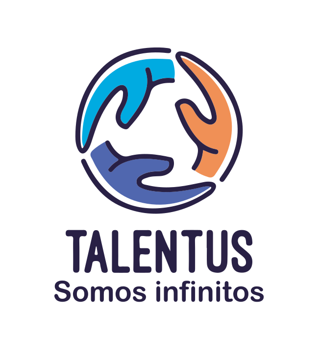

# TalentUS

<p align="center">
  
</p>

Proyecto desarrollado para la 5ª edición de la #HACKATHONF5 de Factoría F5 y propuesto por Globant.

## Descripción

TalentUS es una plataforma de aprendizaje colaborativo que conecta a personas de diferentes edades y habilidades para compartir conocimientos y experiencias de manera intergeneracional. Su misión es promover la conexión humana, el aprendizaje continuo y el crecimiento personal a través de la colaboración en una comunidad inclusiva y solidaria.

## Características principales

- Explora una amplia gama de habilidades y servicios ofrecidos por usuarios de TalentUS.
- Conecta con otros usuarios para aprender, enseñar o participar en proyectos.
- Reserva talleres, clases, servicios y eventos presenciales directamente desde la plataforma.
- Deja reseñas y calificaciones para compartir tu experiencia y ayudar a otros usuarios.
- Participa en talleres y comunidades relacionadas con tus áreas de interés.
- Si quieres anunciarte, personaliza tu perfil, propón tus tarifas o intercambia conocimientos.

## Tecnologías utilizadas
- **Frontend**
  -  React.js (v. 18.2.0)
  -  Node.js (v. 20.9.0)
- **Backend**
  - Laravel (v. 10.10)
  - PHP (v. 8.2.12)
  - Composer (v. 2.7.1)
  - Xampp (v. 8.2.12)

## Guía de instalación

1. Clona el repositorio de [TalentUS](https://github.com/AnaCe-7/Talent-Us) en tu carpeta local.
```
git clone https://github.com/AnaCe-7/Talent-Us
```
2. Navega hasta el directorio raíz del proyecto.
3. Instala las dependencias del frontend utilizando npm:

```
npm install
```

4. Instala las dependencias del backend utilizando Composer:
```
composer install
```

## Configuración

1. Crea un archivo .env en el directorio raíz del backend y configura las variables de entorno necesarias, como la configuración de la base de datos y las credenciales de autenticación.
2. Ejecuta las migraciones y los seeders para configurar la base de datos:

```
php artisan migrate --seed
```

## Uso
1. Inicia el servidor frontend:

```
npm start
```

2. Inicia el servidor backend:

```
php artisan serve
```

3. Abre tu navegador y navega a la dirección proporcionada por el servidor frontend para acceder a TalentUS.

## Authors

- Ana Cecilia [Github](https://github.com/AnaCe-7) · [Linkedin](https://www.linkedin.com/in/ana-cecilia-reques-araujo/)
- Isla [Github](https://github.com/islacrur) · [Linkedin](https://www.linkedin.com/in/isla-cruanes)
- Hemi [Github](https://github.com/HemiCastillo) · [Linkedin](https://www.linkedin.com/in/hemileidis/)
- Noelia [Github](https://github.com/Bedknobs23) · [Linkedin](https://www.linkedin.com/in/noelia-rey-silva/)
- Pilar [Github](https://github.com/Pilarsededuran) · [Linkedin](https://www.linkedin.com/in/pilar-sede%C3%B1o-9340012a4/)
- Sergio [Github](https://github.com/sergiolalu) · [Linkedin](https://www.linkedin.com/in/)
- Emii [Github](https://github.com/) · [Linkedin](https://www.linkedin.com/in/)

<!-- ## Licencia

Este proyecto está bajo la Licencia MIT. -->
